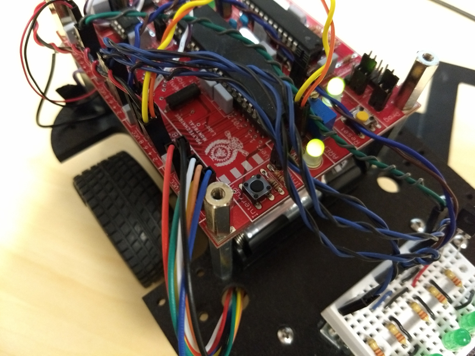
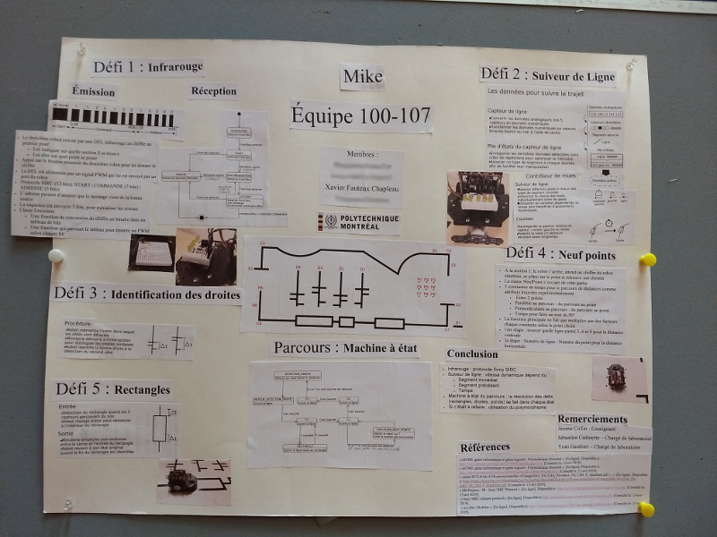

# Projet initial de système embarqué

Ce projet de fin de trimestre exigeait de programmer un robot afin d'effectuer un parcours.
Il devait suivre la piste, tout en performant diverses actions à des moments spécifiques telles qu'allumer des DELS, émettre des sons, pivoter sur lui-même et recevoir des commandes d'un émetteur infrarouge.
D'ailleurs, on peut voir le plan de la piste sur l'image en dessous.

La réalisation du projet a duré un peu plus d'un mois et se faisait en équipe de quatre.
Notre robot s'est bien débrouillé à l'épreuve finale grâce à la dédication de chacun.
Il suivait donc très bien le trajet et avons été très satisfait de sa performance.
